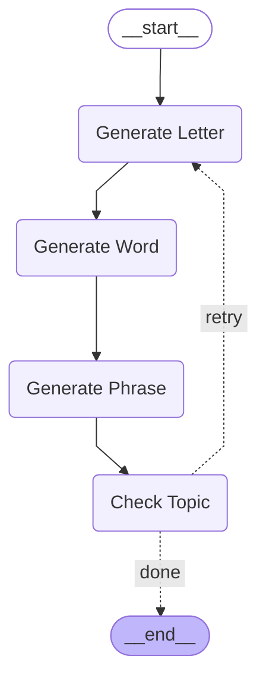

```mermaid
---
config:
  flowchart:
    curve: linear
---
graph TD;
	__start__([<p>__start__</p>]):::first
	Generate\20Letter(Generate Letter)
	Generate\20Word(Generate Word)
	Generate\20Phrase(Generate Phrase)
	Check\20Topic(Check Topic)
	__end__([<p>__end__</p>]):::last
	Check\20Topic -. &nbsp;retry&nbsp; .-> Generate\20Letter;
	Check\20Topic -. &nbsp;done&nbsp; .-> __end__;
	Generate\20Letter --> Generate\20Word;
	Generate\20Phrase --> Check\20Topic;
	Generate\20Word --> Generate\20Phrase;
	__start__ --> Generate\20Letter;
	classDef default fill:#f2f0ff,line-height:1.2
	classDef first fill-opacity:0
	classDef last fill:#bfb6fc

```